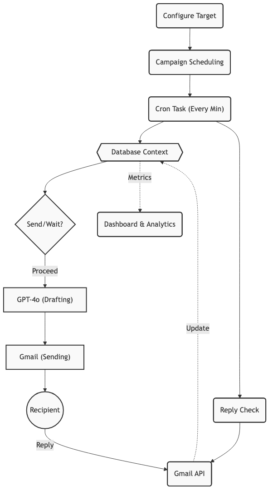
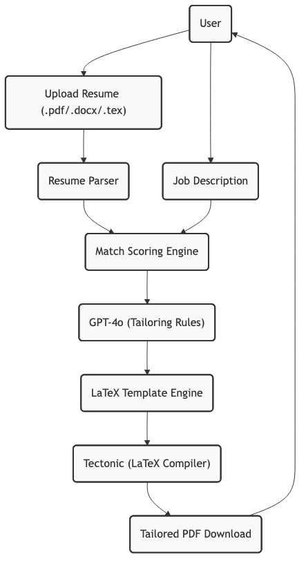
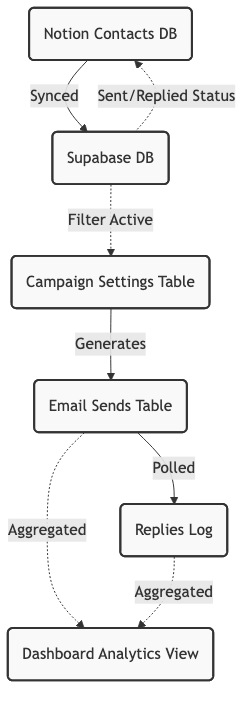
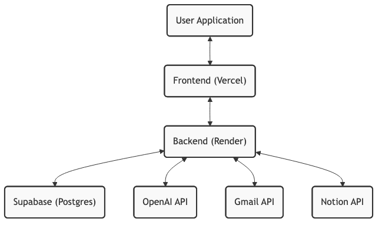

# OutboundAI

Personalised Cold Email Automation Platform for job seekers and founders.

---

## Overview

OutboundAI automates the entire cold email outreach lifecycle — from generating personalized emails to scheduling follow-ups and tracking replies. It integrates with Gmail for sending, Notion for contact management, and OpenAI for context-aware email generation.

**Problem:** Manual cold outreach is time-consuming, inconsistent, and difficult to scale. Writing individualized emails, tracking who replied, and following up at the right time requires sustained effort that most people abandon.

**Target users:** Job seekers running active outreach campaigns, founders doing early customer discovery, and anyone running personalized B2B outreach at volume.

**Core value:** Configure once. The system handles generation, scheduling, follow-ups, reply tracking, and campaign analytics automatically.

---

## Core Features

- **AI-powered email generation** — GPT-4o generates personalized cold emails using the user's professional profile, tone preferences, and contact context
- **Automated follow-up scheduling** — Configurable multi-stage follow-up system (up to N follow-ups) with per-stage delay settings
- **Gmail integration** — OAuth 2.0 connection to user's Gmail account; emails sent directly from their address
- **Notion integration** — Sync contacts from a connected Notion database; contact status updates written back to Notion
- **Campaign automation engine** — Background scheduler runs send cycles every minute, enforces daily limits, and handles state transitions
- **Daily limit enforcement** — Configurable sending limits with plan-based guardrails; prevents account-level deliverability damage
- **Resume optimizer** — Multi-context resume tailoring using the user's uploaded resume, LinkedIn profile data, and target job description; scored output with match analysis
- **Dashboard analytics** — Real-time metrics including conversion funnel (sent → replied → rejected), average reply time, active contacts, and pending pipeline breakdown
- **Email tracking** — Open and reply detection via Gmail API thread polling
- **Responsive inbox** — Full conversation thread view with WhatsApp-style mobile navigation (single-panel on mobile, two-column on tablet, three-column on desktop)

---

## Email Automation Flow

How the system automates end-to-end outreach.



---

## Resume Optimizer Flow

How the system tailors resumes to job descriptions.



---

## Data Flow Diagram

How data moves between external services and local analytics.



---

## System Architecture



### Frontend

- **Framework:** React 19 with Vite 7
- **Styling:** Tailwind CSS v4 + shadcn/ui component library
- **State & Data Fetching:** TanStack Query v5
- **Routing:** Wouter (lightweight client-side router)
- **Animations:** Framer Motion

### Backend

- **Runtime:** Node.js with TypeScript (tsx for dev, esbuild for production)
- **Framework:** Express 5
- **Validation:** Zod schemas on all inbound API payloads
- **Authentication:** Supabase Auth (OAuth + email) + JWT session management
- **Scheduler:** node-cron — runs automation send cycles every minute
- **ORM:** Drizzle ORM with Supabase PostgreSQL

### External Integrations

| Service | Purpose |
|---|---|
| OpenAI (GPT-4o) | Email generation, resume tailoring |
| Gmail API | OAuth sending, thread reading, reply detection |
| Notion API | Contact import, status sync |
| Supabase | Database, authentication, file storage |

---

## User Workflow

1. **Register / Login** — Create an account via Supabase Auth
2. **Connect Gmail** — Authorize Gmail via OAuth 2.0; tokens stored encrypted
3. **Connect Notion** — Authorize Notion and select target database; contacts sync automatically
4. **Configure Profile** — Add professional background, skills, target roles, tone preference, and custom prompt override
5. **Configure Campaign** — Set daily sending limit, number of follow-ups, follow-up delays, send window (start/end time), and timezone
6. **Start Automation** — Enable the automation toggle; the scheduler begins processing contacts in the send window
7. **Monitor Dashboard** — View real-time metrics: emails sent today, total pipeline, conversion funnel, reply rates, and pending follow-ups
8. **Manage Inbox** — View full email thread for each contact; track open and reply status
9. **Use Resume Optimizer** — Upload a resume, paste a job description, receive a tailored output with match scoring

---

## Plan and Limits

| Plan | Daily Limit | Duration |
|---|---|---|
| Free | 5 emails/day | 14 days |
| Owner | Configurable (up to 500/day) | Unlimited |

The `plan-guard.ts` service enforces these limits before each send cycle. Daily usage is tracked in the `daily_usage` table and resets at midnight in the user's configured timezone.

Follow-up sequencing is fully configurable. Each follow-up stage has an independent delay (in days) and message body generated by the AI based on the original email context.

---

## Project Structure

```
/
├── client/                  # React frontend
│   └── src/
│       ├── components/      # Shared UI components (shadcn/ui + custom)
│       ├── hooks/           # Custom React hooks
│       ├── lib/             # API client, utilities, date helpers
│       └── pages/           # Route-level page components
│           ├── landing/     # Public landing page
│           ├── auth/        # Login, signup, forgot password
│           └── app/         # Authenticated app pages
│               ├── dashboard.tsx
│               ├── inbox.tsx
│               ├── campaigns.tsx
│               ├── settings.tsx
│               ├── analytics.tsx
│               ├── integrations.tsx
│               └── profile.tsx
│
├── server/                  # Express backend
│   ├── services/
│   │   ├── automation.ts    # Core automation scheduler and state machine
│   │   ├── email-generator. ts  # OpenAI email generation
│   │   ├── gmail.ts         # Gmail API client (send, read, OAuth)
│   │   ├── notion.ts        # Notion API client (import, sync)
│   │   ├── plan-guard.ts    # Daily limit enforcement
│   │   ├── encryption.ts    # Token encryption/decryption
│   │   └── gmail-retry.ts   # Send retry logic
│   ├── middleware/
│   │   └── validation.ts    # Zod request validation middleware
│   ├── routes.ts            # All API route definitions
│   ├── storage.ts           # Database access layer (Drizzle + Supabase)
│   ├── supabase.ts          # Supabase admin client
│   └── index.ts             # Server entry point
│
├── shared/
│   └── schema.ts            # Shared Drizzle schema + TypeScript types
│
├── package.json
├── vite.config.ts
└── tsconfig.json
```

---

## Environment Variables

Create a `.env` file in the project root with the following variables:

```env
# Supabase
SUPABASE_URL=                    # Supabase project URL
SUPABASE_ANON_KEY=               # Supabase publishable anon key
SUPABASE_SERVICE_ROLE_KEY=       # Supabase service role key (server-only)
DATABASE_URL=                    # PostgreSQL connection string (Supabase)

# Server
PORT=5001
BASE_URL=http://localhost:5001   # Base URL for OAuth redirect URIs

# Encryption
ENCRYPTION_KEY=                  # 64-character hex string for token encryption

# OpenAI
OPENAI_API_KEY=                  # OpenAI API key (GPT-4o access required)

# Gmail OAuth
GOOGLE_CLIENT_ID=                # Google Cloud project OAuth 2.0 client ID
GOOGLE_CLIENT_SECRET=            # Google Cloud project OAuth 2.0 client secret

# Notion OAuth
NOTION_CLIENT_ID=                # Notion integration OAuth client ID
NOTION_CLIENT_SECRET=            # Notion integration OAuth client secret
```

**Note:** Never commit `.env` to version control. The `.gitignore` excludes it by default.

To generate a valid `ENCRYPTION_KEY`:

```bash
node -e "console.log(require('crypto').randomBytes(32).toString('hex'))"
```

---

## Running Locally

### Prerequisites

- Node.js >= 22
- A Supabase project with the schema applied
- A Google Cloud project with Gmail API enabled and OAuth credentials configured
- A Notion integration with OAuth configured

### Setup

```bash
# Clone the repository
git clone https://github.com/AdarshBennur/Gravinz.git
cd Gravinz

# Install dependencies
npm install

# Create and populate your .env file
cp .env.example .env   # (or create manually using the variables listed above)

# Apply the database schema
npm run db:push

# Start the development server (backend + frontend concurrently)
npm run dev
```

The backend runs at `http://localhost:5001`. The frontend is served from the same Express process in development (via Vite middleware integration).

### Build for Production

```bash
# Build the frontend
npm run build:client

# Build the backend
npm run build

# Start production server
npm run start
```

---

## Deployment

### Database — Supabase

1. Create a project at [supabase.com](https://supabase.com)
2. Set `DATABASE_URL`, `SUPABASE_URL`, `SUPABASE_ANON_KEY`, and `SUPABASE_SERVICE_ROLE_KEY` from the project settings
3. Run `npm run db:push` to apply the schema

### Backend — Render

1. Create a new Web Service on [render.com](https://render.com)
2. Connect the GitHub repository
3. Set the following:
   - **Build Command:** `npm install && npm run build:client && npm run build`
   - **Start Command:** `npm run start`
   - **Environment Variables:** Add all variables from the `.env` reference above
4. Set `BASE_URL` to your Render service URL (e.g., `https://your-app.onrender.com`)

### Frontend — Vercel (Optional)

If serving the frontend separately from Vercel:

1. Connect the repository at [vercel.com](https://vercel.com)
2. Set the **Output Directory** to `dist/public`
3. Set the **Build Command** to `npm run build:client`
4. Configure `VITE_API_URL` to point to your Render backend URL

In the current architecture, the Express server serves the built frontend directly, so a separate Vercel deployment is optional.

---

## API Structure

All API routes are prefixed with `/api`. Authentication is enforced via middleware on all protected routes.

| Method | Route | Description |
|---|---|---|
| POST | `/api/auth/register` | Register new user |
| POST | `/api/auth/login` | Login and return session token |
| GET | `/api/auth/me` | Get current authenticated user |
| GET | `/api/profile` | Get full user profile |
| PUT | `/api/profile` | Update profile, experiences, projects |
| GET | `/api/campaign-settings` | Get campaign configuration |
| PUT | `/api/campaign-settings` | Update campaign settings |
| GET | `/api/dashboard` | Get dashboard summary |
| GET | `/api/dashboard/metrics` | Get extended analytics metrics |
| GET | `/api/inbox/threads` | List all conversation threads |
| GET | `/api/inbox/threads/:id` | Get thread detail for a contact |
| GET | `/api/inbox/threads/:id/gmail` | Fetch live Gmail thread |
| GET | `/api/contacts` | List all contacts |
| DELETE | `/api/contacts/clear` | Remove all imported contacts |
| POST | `/api/integrations/gmail/auth` | Initiate Gmail OAuth flow |
| GET | `/api/integrations/notion/sync` | Sync contacts from Notion |
| POST | `/api/profile/resume` | Upload resume file |
| POST | `/api/resume-optimizer` | Run resume optimizer |

---

## Security Considerations

- **Gmail tokens** are encrypted at rest using AES-256 (via `encryption.ts`) before storage in the database. The `ENCRYPTION_KEY` must be set and never rotated without migrating existing tokens.
- **Authentication** uses Supabase Auth (session-based) with JWT tokens validated on each request. All app routes behind `requireAuth` middleware reject unauthenticated requests with 401.
- **API keys** (OpenAI, Google, Notion) are backend-only and never exposed to the client.
- **Rate limiting** is applied at the API level via `express-rate-limit`. Automation additionally enforces per-user daily sending limits before any email send.
- **Zod validation** is applied to all inbound API payloads; malformed requests are rejected with descriptive 400 errors before reaching business logic.
- **CORS** is configured to restrict cross-origin requests in production to known frontend origins.
- **Helmet.js** sets standard HTTP security headers on all responses.

---

## Known Limitations

- **Email deliverability** depends on the health and reputation of the sender's Gmail account and domain. Using a fresh or low-volume Gmail account for high-volume outreach increases the likelihood of deliverability issues or account flagging by Google.
- **Gmail API quota** — The Gmail API has per-user sending quotas imposed by Google. If quota is exceeded, emails will fail silently until quota resets. Monitor your Google Cloud Console quota usage.
- **Reply detection latency** — Replies are detected by polling Gmail threads on each automation cycle (every minute). There is no real-time push notification; reply detection can lag by up to a minute.
- **Notion sync is one-directional by default** — Contact data is imported from Notion; status fields are written back to Notion, but structural changes to the Notion database schema may break sync.
- **Resume optimizer output quality** depends on the clarity and completeness of the uploaded resume and target job description. Incomplete inputs produce lower-quality tailoring.
- **Single-user architecture** — The current schema and automation engine are designed for single-user accounts. Multi-tenant team support is not yet implemented.

---

## Roadmap

- Multi-user team accounts with shared contact pools and campaign management
- A/B testing for subject lines and email body variants
- Advanced analytics with per-campaign and per-cohort breakdown
- Email warmup automation for new sender accounts
- CRM integrations (HubSpot, Salesforce, Airtable)
- Webhook support for reply and bounce events
- Template library with community-contributed email sequences
- Slack notifications for replies and campaign milestones

---

## License

MIT License

Copyright (c) 2025 Adarsh Bennur

Permission is hereby granted, free of charge, to any person obtaining a copy of this software and associated documentation files (the "Software"), to deal in the Software without restriction, including without limitation the rights to use, copy, modify, merge, publish, distribute, sublicense, and/or sell copies of the Software, and to permit persons to whom the Software is furnished to do so, subject to the following conditions:

The above copyright notice and this permission notice shall be included in all copies or substantial portions of the Software.

THE SOFTWARE IS PROVIDED "AS IS", WITHOUT WARRANTY OF ANY KIND, EXPRESS OR IMPLIED, INCLUDING BUT NOT LIMITED TO THE WARRANTIES OF MERCHANTABILITY, FITNESS FOR A PARTICULAR PURPOSE AND NONINFRINGEMENT. IN NO EVENT SHALL THE AUTHORS OR COPYRIGHT HOLDERS BE LIABLE FOR ANY CLAIM, DAMAGES OR OTHER LIABILITY, WHETHER IN AN ACTION OF CONTRACT, TORT OR OTHERWISE, ARISING FROM, OUT OF OR IN CONNECTION WITH THE SOFTWARE OR THE USE OR OTHER DEALINGS IN THE SOFTWARE.
