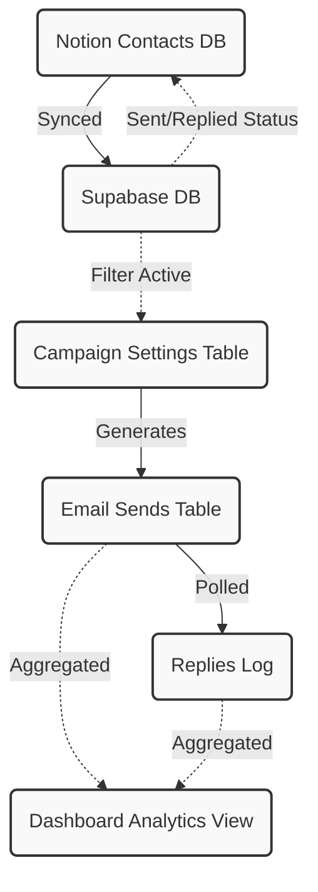

```mermaid
graph TD;
  Notion("Notion Contacts DB");
  AppDB("Supabase DB");
  CampaignConfig("Campaign Settings Table");
  EmailSends("Email Sends Table");
  Replies("Replies Log");
  Dashboard("Dashboard Analytics View");

  Notion -- Synced --> AppDB
  AppDB -. Filter Active .-> CampaignConfig
  CampaignConfig -- Generates --> EmailSends
  EmailSends -- Polled --> Replies
  EmailSends -. Aggregated .-> Dashboard
  Replies -. Aggregated .-> Dashboard
  AppDB -. Sent/Replied Status .-> Notion

  classDef default fill:#f9f9f9,stroke:#333,stroke-width:2px;
```
