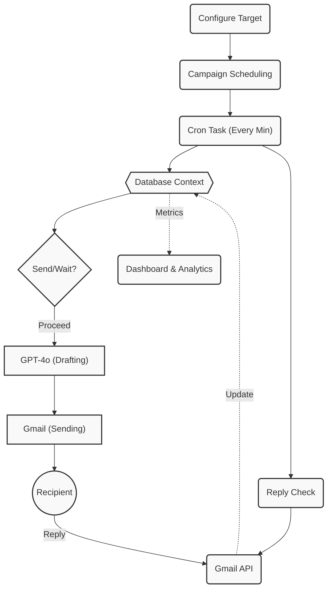

```mermaid
graph TD;
  Configure("Configure Target");
  Campaign("Campaign Scheduling");
  Scheduler("Cron Task (Every Min)");
  Decision{"Send/Wait?"};
  OpenAI["GPT-4o (Drafting)"];
  Gmail["Gmail (Sending)"];
  Recipient((Recipient));
  GmailAPI("Gmail API");
  DB{{"Database Context"}};
  Reply("Reply Check");
  Dashboard("Dashboard & Analytics");

  Configure --> Campaign
  Campaign --> Scheduler
  Scheduler --> DB
  DB --> Decision
  Decision -- Proceed --> OpenAI
  OpenAI --> Gmail
  Gmail --> Recipient
  Recipient -- Reply --> GmailAPI
  Scheduler --> Reply
  Reply --> GmailAPI
  GmailAPI -. Update .-> DB
  DB -. Metrics .-> Dashboard

  classDef default fill:#f9f9f9,stroke:#333,stroke-width:2px;
```
