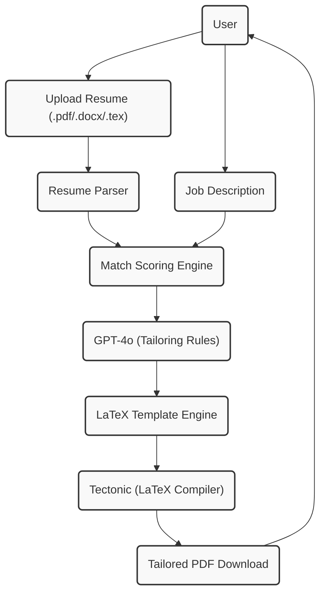

```mermaid
graph TD;
  User("User");
  Upload("Upload Resume (.pdf/.docx/.tex)");
  Parser("Resume Parser");
  PasteJD("Job Description");
  MatchEngine("Match Scoring Engine");
  AI("GPT-4o (Tailoring Rules)");
  LaTeXMutator("LaTeX Template Engine");
  Compiler("Tectonic (LaTeX Compiler)");
  Download("Tailored PDF Download");

  User --> Upload
  User --> PasteJD
  Upload --> Parser
  Parser --> MatchEngine
  PasteJD --> MatchEngine
  MatchEngine --> AI
  AI --> LaTeXMutator
  LaTeXMutator --> Compiler
  Compiler --> Download
  Download --> User

  classDef default fill:#f9f9f9,stroke:#333,stroke-width:2px;
```
