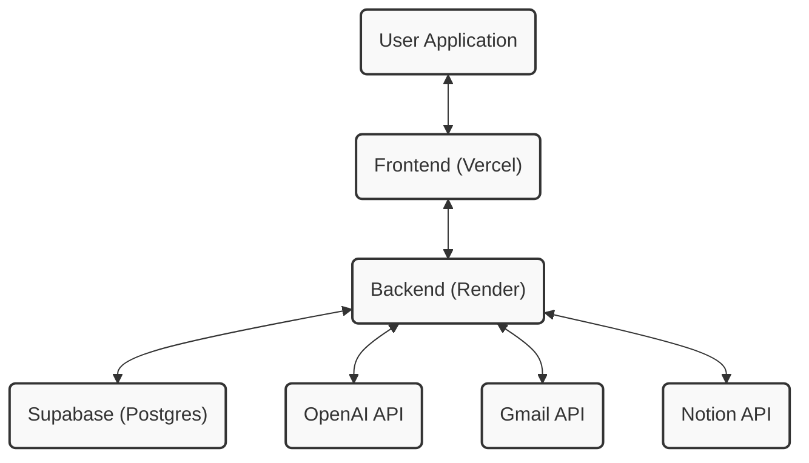

```mermaid
graph TD;
  User("User Application");
  Frontend("Frontend (Vercel)");
  Backend("Backend (Render)");
  Database("Supabase (Postgres)");
  OpenAI("OpenAI API");
  Gmail("Gmail API");
  Notion("Notion API");

  User <--> Frontend;
  Frontend <--> Backend;
  Backend <--> Database;
  Backend <--> OpenAI;
  Backend <--> Gmail;
  Backend <--> Notion;

  classDef default fill:#f9f9f9,stroke:#333,stroke-width:2px;
```
